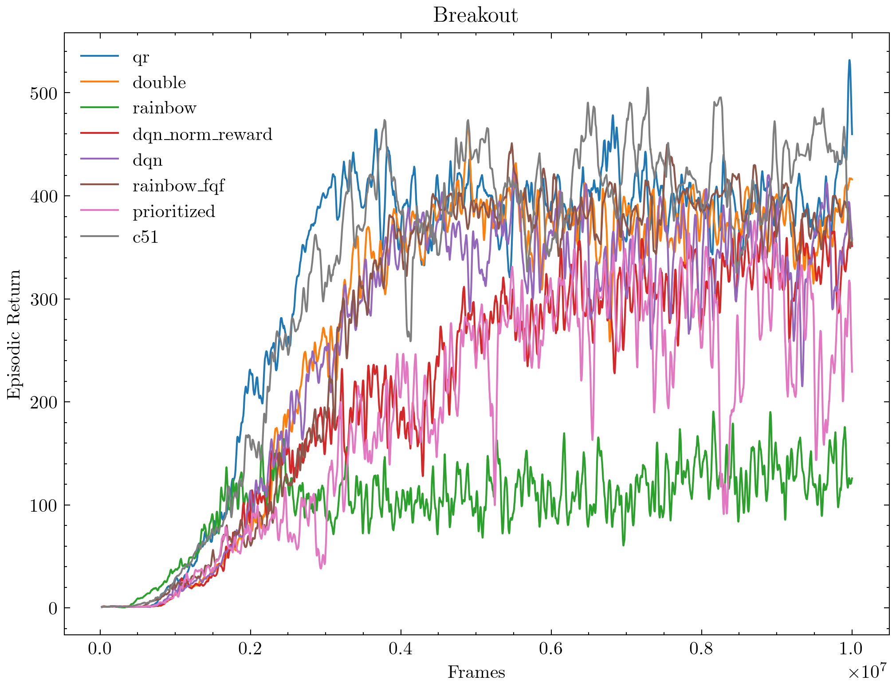
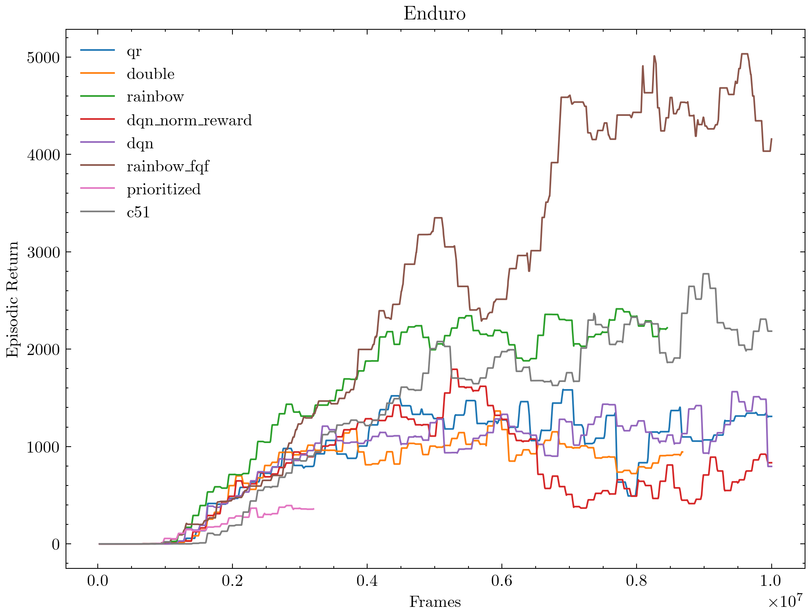
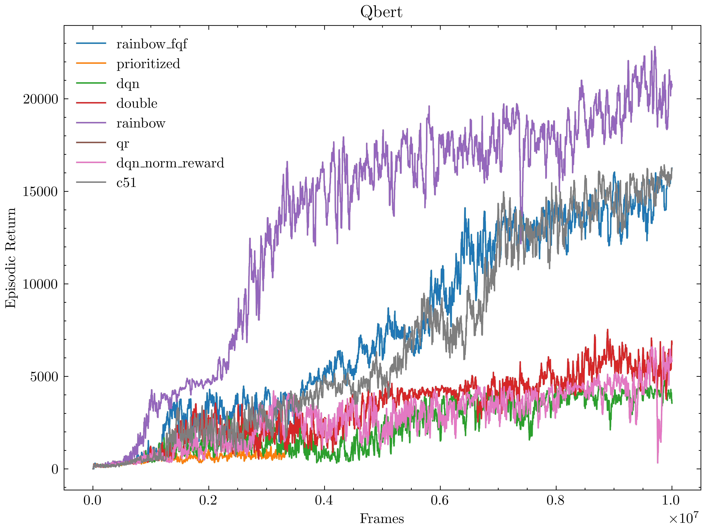
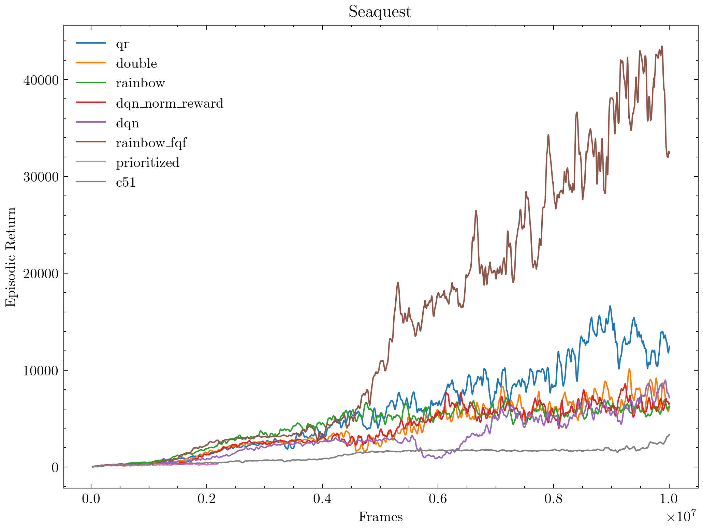
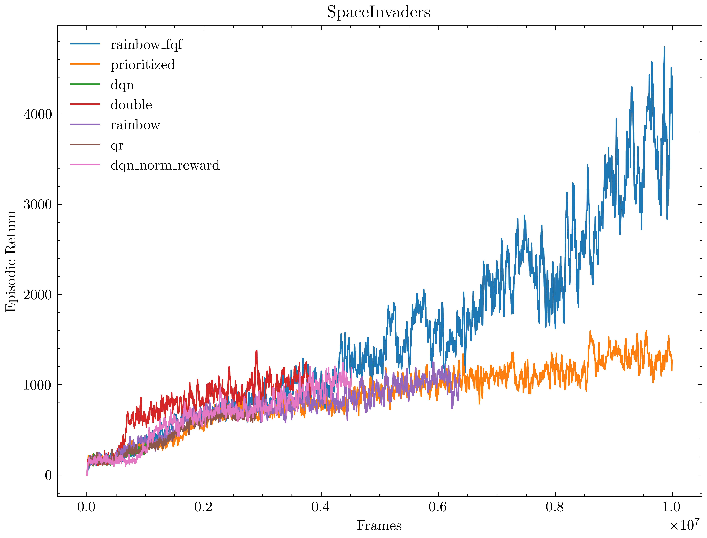

# AgentZero

## Introduction

AgentZero is a Lightweight Distributed Reinforcement Learning Framework based on Pytorch and DeepMind Launchpad.


## Installation
```bash
git clone https://github.com/zhoubin-me/AgentZero
cd AgentZero
conda env create -f environment.yml -n agent0
conda activate agent0
pip install tensorflow==2.8.4
pip install protobuf==3.20.3
```
**Note**: DO NOT use ```pip install -r requirements.txt``` which will create a very slow environment. Package version matches for these two, but reason unknown for slow environment.


## Hardware Requirements:
- A GPU
- RAM > 16G


## Speed Test
Hardware Setting:
 - CPU: Intel i9-13900KF
 - GPU: RTX 4090
 - RAM: 32 GB
 - Game: Breakout
 - Algorithm: dqn
 - FPS: 5000++ x 4 = **20000++**

Here FPS (frame per second) means frames collected and saved to replay buffer per second. With 4 frame skip, its FPS is 5000x4= **20000++** in deepmind's word. 
Other implementations usually fall below 100 FPS after exploration. The bottle net is actually at data transferring from CPU to GPU.

## Run
Single thread run:
```bash
python -m agent0.deepq.main
```

Launchpad mulit-thread run:
```bash
python -m agent.deepq.launch
```

Specify game:
```bash
python -m agent0.deepq.launch env_id=enduro
```

Specify algorithms:
```bash
# Our current implementation includes: c51, qr, mdqn, iqr, fqf
python -m agent0.deepq.launch learner.algo=c51
```

<!-- 
Run like in rainbow:
```bash
# exp_name will specify checkpoint directory under $HOME/ray_results
python -m agent0.deepq.run --double_q --dueling --noisy --priortize --n_step 3 --game atari47 --algo c51 --exp_name atari_rainbow
``` -->

## Sample Run Result @10M Frames
| exp_name                 | commit | algo | game          | mean     | std      | max   | min  | size | frames   |
|--------------------------|--------|------|---------------|----------|----------|-------|------|------|----------|
| atari8_double_duel_prior | 21d95f | iqr  | Asterix       | 23125.00 | 10256.55 | 35700 | 8100 | 12   | 10000320 |
| atari8_double_duel_prior | 21d95f | mdqn | Asterix       | 5975.00  | 1882.87  | 8700  | 2200 | 12   | 9600000  |
| atari8_double_duel_prior | 21d95f | fqf  | Asterix       | 62750.00 | 21467.16 | 84500 | 9100 | 12   | 9440000  |
| atari8_double_duel_prior | 21d95f | c51  | Asterix       | 18092.31 | 10650.93 | 36100 | 5100 | 13   | 9600000  |
| atari8_double_duel_prior | 21d95f | qr   | Asterix       | 6608.33  | 1491.34  | 8300  | 3300 | 12   | 9600000  |
| atari8_double_duel_prior | 21d95f | dqn  | Asterix       | 3716.67  | 1331.72  | 6500  | 2050 | 12   | 9440000  |
| atari8_double_duel_prior | 21d95f | qr   | BeamRider     | 4443.00  | 1306.49  | 6354  | 2440 | 12   | 2720000  |
| atari8_double_duel_prior | 21d95f | c51  | BeamRider     | 7474.67  | 3226.43  | 13536 | 3308 | 12   | 7840000  |
| atari8_double_duel_prior | 21d95f | dqn  | BeamRider     | 4925.83  | 1626.64  | 7272  | 2552 | 12   | 9600000  |
| atari8_double_duel_prior | 21d95f | iqr  | BeamRider     | 8193.00  | 2610.15  | 12494 | 3420 | 12   | 9440000  |
| atari8_double_duel_prior | 21d95f | fqf  | BeamRider     | 11323.33 | 3096.31  | 16714 | 3420 | 12   | 9760000  |
| atari8_double_duel_prior | 21d95f | mdqn | BeamRider     | 6777.67  | 1523.32  | 10254 | 4540 | 12   | 8800000  |
| atari8_double_duel_prior | 21d95f | iqr  | Breakout      | 547.92   | 188.06   | 846   | 364  | 12   | 5440000  |
| atari8_double_duel_prior | 21d95f | fqf  | Breakout      | 457.42   | 221.71   | 821   | 101  | 12   | 6880000  |
| atari8_double_duel_prior | 21d95f | mdqn | Breakout      | 480.50   | 187.86   | 798   | 289  | 12   | 8800000  |
| atari8_double_duel_prior | 21d95f | c51  | Breakout      | 521.42   | 178.23   | 848   | 392  | 12   | 9280000  |
| atari8_double_duel_prior | 21d95f | qr   | Breakout      | 441.00   | 118.13   | 823   | 346  | 12   | 8320000  |
| atari8_double_duel_prior | 21d95f | dqn  | Breakout      | 394.42   | 125.28   | 784   | 279  | 12   | 7040000  |
| atari8_double_duel_prior | 21d95f | fqf  | Enduro        | 3238.67  | 1262.06  | 4682  | 1097 | 12   | 7040000  |
| atari8_double_duel_prior | 21d95f | c51  | Enduro        | 3066.83  | 1302.05  | 5256  | 1697 | 12   | 8800000  |
| atari8_double_duel_prior | 21d95f | iqr  | Enduro        | 2710.75  | 975.33   | 4999  | 1948 | 12   | 9280000  |
| atari8_double_duel_prior | 21d95f | qr   | Enduro        | 1653.17  | 383.46   | 2155  | 1061 | 12   | 7520000  |
| atari8_double_duel_prior | 21d95f | dqn  | Enduro        | 923.42   | 245.54   | 1342  | 434  | 12   | 4160000  |
| atari8_double_duel_prior | 21d95f | mdqn | Enduro        | 1322.08  | 237.94   | 1856  | 1061 | 12   | 9600000  |
| atari8_double_duel_prior | 21d95f | fqf  | MsPacman      | 2809.17  | 865.35   | 4990  | 1580 | 12   | 6240000  |
| atari8_double_duel_prior | 21d95f | iqr  | MsPacman      | 2505.83  | 576.46   | 3520  | 1800 | 12   | 7200000  |
| atari8_double_duel_prior | 21d95f | c51  | MsPacman      | 2960.00  | 1208.13  | 5730  | 1660 | 12   | 6560000  |
| atari8_double_duel_prior | 21d95f | mdqn | MsPacman      | 2383.85  | 595.13   | 3430  | 1290 | 13   | 5760000  |
| atari8_double_duel_prior | 21d95f | dqn  | MsPacman      | 2178.33  | 969.13   | 4030  | 1030 | 12   | 4640000  |
| atari8_double_duel_prior | 21d95f | qr   | MsPacman      | 2458.33  | 483.16   | 3910  | 2030 | 12   | 9600000  |
| atari8_double_duel_prior | 21d95f | dqn  | Qbert         | 4414.58  | 890.13   | 7325  | 3925 | 12   | 9600000  |
| atari8_double_duel_prior | 21d95f | fqf  | Qbert         | 13110.42 | 2713.48  | 15775 | 7800 | 12   | 9760000  |
| atari8_double_duel_prior | 21d95f | mdqn | Qbert         | 6556.25  | 2236.21  | 11700 | 3850 | 12   | 9920000  |
| atari8_double_duel_prior | 21d95f | c51  | Qbert         | 15320.83 | 3567.43  | 19050 | 4250 | 12   | 9920000  |
| atari8_double_duel_prior | 21d95f | qr   | Qbert         | 6793.75  | 2245.37  | 11975 | 4025 | 12   | 9120000  |
| atari8_double_duel_prior | 21d95f | iqr  | Qbert         | 11662.50 | 3233.86  | 15425 | 4450 | 12   | 10000320 |
| atari8_double_duel_prior | 21d95f | c51  | Seaquest      | 3528.33  | 1069.28  | 4540  | 1540 | 12   | 10000320 |
| atari8_double_duel_prior | 21d95f | fqf  | Seaquest      | 12346.67 | 5986.69  | 22620 | 4780 | 12   | 6880000  |
| atari8_double_duel_prior | 21d95f | qr   | Seaquest      | 5800.83  | 1336.58  | 8320  | 3600 | 12   | 9600000  |
| atari8_double_duel_prior | 21d95f | iqr  | Seaquest      | 7248.33  | 608.25   | 8280  | 6460 | 12   | 10000320 |
| atari8_double_duel_prior | 21d95f | dqn  | Seaquest      | 2310.00  | 506.46   | 3200  | 1400 | 12   | 6720000  |
| atari8_double_duel_prior | 21d95f | mdqn | Seaquest      | 6223.33  | 1369.84  | 8500  | 4340 | 12   | 9440000  |
| atari8_double_duel_prior | 21d95f | dqn  | SpaceInvaders | 885.00   | 383.62   | 1695  | 490  | 12   | 6400000  |
| atari8_double_duel_prior | 21d95f | c51  | SpaceInvaders | 2285.83  | 774.62   | 3365  | 575  | 12   | 10000320 |
| atari8_double_duel_prior | 21d95f | iqr  | SpaceInvaders | 1809.23  | 642.42   | 3080  | 775  | 13   | 9440000  |
| atari8_double_duel_prior | 21d95f | mdqn | SpaceInvaders | 1087.08  | 348.79   | 1715  | 570  | 12   | 9760000  |
| atari8_double_duel_prior | 21d95f | fqf  | SpaceInvaders | 2265.00  | 894.04   | 4275  | 1205 | 12   | 8160000  |
| atari8_double_duel_prior | 21d95f | qr   | SpaceInvaders | 1301.25  | 654.69   | 2805  | 525  | 12   | 9280000  |













